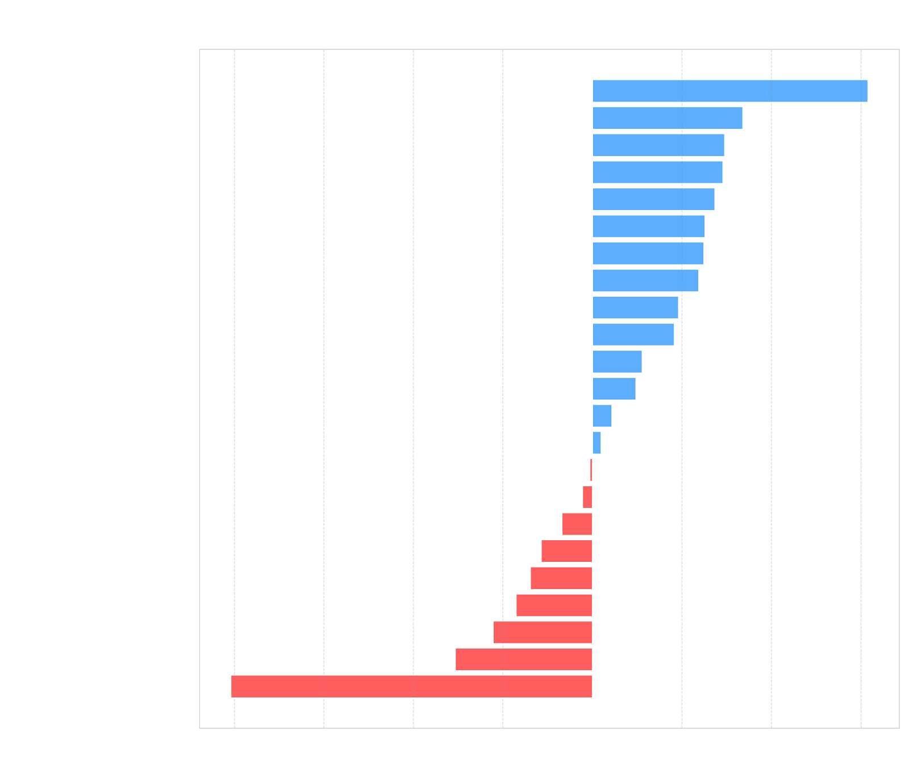

# Custom Linked HashMap

Implementation of a LinkedHashMap.

All methods implemented are identical to those found in the Java Map interface.

# Build and Test

To build and test the project run command `./gradlew clean build`

To test the project run command `./gradlew test`

# Time Complexity

| Method                       | CustomLinkedHashMap | LinkedHashMap (JDK) | Winner |
|------------------------------|:-------------------:|:-------------------:|:------:|
| **clear()**                  |       $O(n)$        |       $O(n)$        |  Tie   |
| **containsKey(Object)**      |       $O(1)$        |       $O(1)$        |  Tie   |
| **containsValue(Object)**    |       $O(n)$        |       $O(n)$        |  Tie   |
| **entrySet()**               |       $O(1)$        |       $O(1)$        |  Tie   |
| **equals(Object)**           |       $O(n)$        |       $O(n)$        |  Tie   |
| **get(Object)**              |       $O(1)$        |       $O(1)$        |  Tie   |
| **getOrDefault(Object, V)**  |       $O(1)$        |       $O(1)$        |  Tie   |
| **hashCode()**               |       $O(n)$        |       $O(n)$        |  Tie   |
| **isEmpty()**                |       $O(1)$        |       $O(1)$        |  Tie   |
| **keySet()**                 |       $O(1)$        |       $O(1)$        |  Tie   |
| **put(K, V)**                |       $O(1)$        |       $O(1)$        |  Tie   |
| **putAll(Map)**              |       $O(m)$        |       $O(m)$        |  Tie   |
| **putIfAbsent(K, V)**        |       $O(1)$        |       $O(1)$        |  Tie   |
| **remove(Object)**           |       $O(1)$        |       $O(1)$        |  Tie   |
| **remove(Object, Object)**   |       $O(1)$        |       $O(1)$        |  Tie   |
| **removeEldestEntry(Entry)** |       $O(1)$        |       $O(1)$        |  Tie   |
| **replace(K, V)**            |       $O(1)$        |       $O(1)$        |  Tie   |
| **replace(K, V, V)**         |       $O(1)$        |       $O(1)$        |  Tie   |
| **size()**                   |       $O(1)$        |       $O(1)$        |  Tie   |
| **toString()**               |       $O(n)$        |       $O(n)$        |  Tie   |
| **values()**                 |       $O(1)$        |       $O(1)$        |  Tie   |

# Space Complexity

| Method                       | CustomLinkedHashMap | LinkedHashMap (JDK) | Winner |
|------------------------------|:-------------------:|:-------------------:|:------:|
| **clear()**                  |  $O(1)$ auxiliary   |  $O(1)$ auxiliary   |  Tie   |
| **containsKey(Object)**      |  $O(1)$ auxiliary   |  $O(1)$ auxiliary   |  Tie   |
| **containsValue(Object)**    |  $O(1)$ auxiliary   |  $O(1)$ auxiliary   |  Tie   |
| **entrySet()**               |  $O(1)$ auxiliary   |  $O(1)$ auxiliary   |  Tie   |
| **equals(Object)**           |  $O(1)$ auxiliary   |  $O(1)$ auxiliary   |  Tie   |
| **get(Object)**              |  $O(1)$ auxiliary   |  $O(1)$ auxiliary   |  Tie   |
| **getOrDefault(Object, V)**  |  $O(1)$ auxiliary   |  $O(1)$ auxiliary   |  Tie   |
| **hashCode()**               |  $O(1)$ auxiliary   |  $O(1)$ auxiliary   |  Tie   |
| **isEmpty()**                |  $O(1)$ auxiliary   |  $O(1)$ auxiliary   |  Tie   |
| **keySet()**                 |  $O(1)$ auxiliary   |  $O(1)$ auxiliary   |  Tie   |
| **put(K, V)**                |  $O(1)$ auxiliary   |  $O(1)$ auxiliary   |  Tie   |
| **putAll(Map)**              |  $O(m)$ auxiliary   |  $O(m)$ auxiliary   |  Tie   |
| **putIfAbsent(K, V)**        |  $O(1)$ auxiliary   |  $O(1)$ auxiliary   |  Tie   |
| **remove(Object)**           |  $O(1)$ auxiliary   |  $O(1)$ auxiliary   |  Tie   |
| **remove(Object, Object)**   |  $O(1)$ auxiliary   |  $O(1)$ auxiliary   |  Tie   |
| **removeEldestEntry(Entry)** |  $O(1)$ auxiliary   |  $O(1)$ auxiliary   |  Tie   |
| **replace(K, V)**            |  $O(1)$ auxiliary   |  $O(1)$ auxiliary   |  Tie   |
| **replace(K, V, V)**         |  $O(1)$ auxiliary   |  $O(1)$ auxiliary   |  Tie   |
| **size()**                   |  $O(1)$ auxiliary   |  $O(1)$ auxiliary   |  Tie   |
| **toString()**               |  $O(1)$ auxiliary   |  $O(1)$ auxiliary   |  Tie   |
| **values()**                 |  $O(1)$ auxiliary   |  $O(1)$ auxiliary   |  Tie   |

**Notes**:
- **n**: Total number of key-value mappings currently in the map.
- **m**: Number of key-value mappings in the input map.

# Performance

Below performance is a comparison made at 100,000 operations per method.

Note: all data is an average of 100 runs.

| Method                           | CustomLinkedHashMap (ns) | LinkedHashMap (JDK) (ns) |   Winner    | Margin  |
|:---------------------------------|:-------------------------|:-------------------------|:-----------:|:-------:|
| `clear()`                        | 56,136.1                 | 38,475.3                 |   **JDK**   |  1.46x  |
| `compute(K,BiFunction)`          | 285.6                    | 385.2                    | **Custom**  |  1.35x  |
| `computeIfAbsent(K,Function)`    | 1,266.3                  | 2,269.0                  | **Custom**  |  1.79x  |
| `computeIfPresent(K,BiFunction)` | 257.1                    | 313.3                    | **Custom**  |  1.22x  |
| `containsKey(K)`                 | 102.0                    | 125.6                    | **Custom**  |  1.23x  |
| `containsValue(V)`               | 109,835.6                | 110,953.0                | **Custom**  |  1.01x  |
| `entrySet()`                     | 80.1                     | 77.8                     |   **JDK**   |  1.03x  |
| `equals(Object o)`               | 291,771.9                | 309,187.0                | **Custom**  |  1.06x  |
| `forEach(BiConsumer)`            | 184,223.7                | 161,824.9                |   **JDK**   |  1.14x  |
| `get(K)`                         | 63.1                     | 96.0                     | **Custom**  |  1.52x  |
| `getOrDefault(K,V)`              | 131.3                    | 162.2                    | **Custom**  |  1.24x  |
| `keySet()`                       | 86.0                     | 127.4                    | **Custom**  |  1.48x  |
| `merge(K,V,BiFunction)`          | 215.1                    | 289.6                    | **Custom**  |  1.35x  |
| `put(K,V)`                       | 465.8                    | 602.7                    | **Custom**  |  1.29x  |
| `putAll(Map)`                    | 1,400,233.9              | 1,430,576.4              | **Custom**  |  1.02x  |
| `putIfAbsent(K,V)`               | 1,521.8                  | 750.9                    |   **JDK**   |  2.03x  |
| `remove(K)`                      | 1,432.4                  | 1,408.9                  |   **JDK**   |  1.02x  |
| `remove(K,V)`                    | 1,988.3                  | 2,652.3                  | **Custom**  |  1.33x  |
| `replace(K,V)`                   | 133.6                    | 141.0                    | **Custom**  |  1.06x  |
| `replace(K,V,V)`                 | 272.2                    | 216.4                    |   **JDK**   |  1.26x  |
| `replaceAll(BiFunction)`         | 660,805.1                | 636,214.0                |   **JDK**   |  1.04x  |
| `toString()`                     | 1,283,370.9              | 1,581,979.8              | **Custom**  |  1.23x  |
| `values()`                       | 64.0                     | 64.6                     | **Custom**  |  1.01x  |

# Performance Charts

#### Note: The following performance charts are designed to be viewed in dark mode.

