# Custom Linked HashMap

Implementation of a LinkedHashMap.

All methods implemented are identical to those found in the Java Map interface.

# Build and Test

To build and test the project run command `./gradlew clean build`

To test the project run command `./gradlew test`

# Time Complexity

| Method                       | CustomLinkedHashMap | LinkedHashMap (JDK) | Winner |
|------------------------------|:-------------------:|:-------------------:|:------:|
| **clear()**                  |       $O(n)$        |       $O(n)$        |  Tie   |
| **containsKey(Object)**      |       $O(1)$        |       $O(1)$        |  Tie   |
| **containsValue(Object)**    |       $O(n)$        |       $O(n)$        |  Tie   |
| **entrySet()**               |       $O(1)$        |       $O(1)$        |  Tie   |
| **equals(Object)**           |       $O(n)$        |       $O(n)$        |  Tie   |
| **get(Object)**              |       $O(1)$        |       $O(1)$        |  Tie   |
| **getOrDefault(Object, V)**  |       $O(1)$        |       $O(1)$        |  Tie   |
| **hashCode()**               |       $O(n)$        |       $O(n)$        |  Tie   |
| **isEmpty()**                |       $O(1)$        |       $O(1)$        |  Tie   |
| **keySet()**                 |       $O(1)$        |       $O(1)$        |  Tie   |
| **put(K, V)**                |       $O(1)$        |       $O(1)$        |  Tie   |
| **putAll(Map)**              |       $O(m)$        |       $O(m)$        |  Tie   |
| **putIfAbsent(K, V)**        |       $O(1)$        |       $O(1)$        |  Tie   |
| **remove(Object)**           |       $O(1)$        |       $O(1)$        |  Tie   |
| **remove(Object, Object)**   |       $O(1)$        |       $O(1)$        |  Tie   |
| **removeEldestEntry(Entry)** |       $O(1)$        |       $O(1)$        |  Tie   |
| **replace(K, V)**            |       $O(1)$        |       $O(1)$        |  Tie   |
| **replace(K, V, V)**         |       $O(1)$        |       $O(1)$        |  Tie   |
| **size()**                   |       $O(1)$        |       $O(1)$        |  Tie   |
| **toString()**               |       $O(n)$        |       $O(n)$        |  Tie   |
| **values()**                 |       $O(1)$        |       $O(1)$        |  Tie   |

# Space Complexity

| Method                       | CustomLinkedHashMap | LinkedHashMap (JDK) | Winner |
|------------------------------|:-------------------:|:-------------------:|:------:|
| **clear()**                  |  $O(1)$ auxiliary   |  $O(1)$ auxiliary   |  Tie   |
| **containsKey(Object)**      |  $O(1)$ auxiliary   |  $O(1)$ auxiliary   |  Tie   |
| **containsValue(Object)**    |  $O(1)$ auxiliary   |  $O(1)$ auxiliary   |  Tie   |
| **entrySet()**               |  $O(1)$ auxiliary   |  $O(1)$ auxiliary   |  Tie   |
| **equals(Object)**           |  $O(1)$ auxiliary   |  $O(1)$ auxiliary   |  Tie   |
| **get(Object)**              |  $O(1)$ auxiliary   |  $O(1)$ auxiliary   |  Tie   |
| **getOrDefault(Object, V)**  |  $O(1)$ auxiliary   |  $O(1)$ auxiliary   |  Tie   |
| **hashCode()**               |  $O(1)$ auxiliary   |  $O(1)$ auxiliary   |  Tie   |
| **isEmpty()**                |  $O(1)$ auxiliary   |  $O(1)$ auxiliary   |  Tie   |
| **keySet()**                 |  $O(1)$ auxiliary   |  $O(1)$ auxiliary   |  Tie   |
| **put(K, V)**                |  $O(1)$ auxiliary   |  $O(1)$ auxiliary   |  Tie   |
| **putAll(Map)**              |  $O(m)$ auxiliary   |  $O(m)$ auxiliary   |  Tie   |
| **putIfAbsent(K, V)**        |  $O(1)$ auxiliary   |  $O(1)$ auxiliary   |  Tie   |
| **remove(Object)**           |  $O(1)$ auxiliary   |  $O(1)$ auxiliary   |  Tie   |
| **remove(Object, Object)**   |  $O(1)$ auxiliary   |  $O(1)$ auxiliary   |  Tie   |
| **removeEldestEntry(Entry)** |  $O(1)$ auxiliary   |  $O(1)$ auxiliary   |  Tie   |
| **replace(K, V)**            |  $O(1)$ auxiliary   |  $O(1)$ auxiliary   |  Tie   |
| **replace(K, V, V)**         |  $O(1)$ auxiliary   |  $O(1)$ auxiliary   |  Tie   |
| **size()**                   |  $O(1)$ auxiliary   |  $O(1)$ auxiliary   |  Tie   |
| **toString()**               |  $O(1)$ auxiliary   |  $O(1)$ auxiliary   |  Tie   |
| **values()**                 |  $O(1)$ auxiliary   |  $O(1)$ auxiliary   |  Tie   |

**Notes**:
- **n**: Total number of key-value mappings currently in the map.
- **m**: Number of key-value mappings in the input map.

# Performance

Below performance is a comparison made at 100,000 operations per method.

Note: all data is an average of 100 runs.

| Method                           | Custom (ns) | JDK (ns)      |            Winner            | Margin |
|:---------------------------------|:------------|:--------------|:----------------------------:|:------:|
| `clear()`                        | 28,535.9    | 45,555.5      |          **Custom**          | 1.60x  |
| `compute(K,BiFunction)`          | 423.3       | 704.4         |          **Custom**          | 1.66x  |
| `computeIfAbsent(K,Function)`    | 332.5       | 479.6         |          **Custom**          | 1.44x  |
| `computeIfPresent(K,BiFunction)` | 901.2       | 808.7         | **Statistically Equivalent** | 1.11x  |
| `containsKey(K)`                 | 386.1       | 219.3         |           **JDK**            | 1.76x  |
| `containsValue(V)`               | 99,969.7    | 93,591.9      | **Statistically Equivalent** | 1.07x  |
| `entrySet()`                     | 89.5        | 78.3          | **Statistically Equivalent** | 1.14x  |
| `equals(Object o)`               | 1,752,548.9 | 2,010,807.3   | **Statistically Equivalent** | 1.15x  |
| `forEach(BiConsumer)`            | 205,479.1   | 203,343.5     | **Statistically Equivalent** | 1.01x  |
| `get(K)`                         | 313.1       | 222.9         |           **JDK**            | 1.40x  |
| `getOrDefault(K,V)`              | 437.2       | 283.6         |           **JDK**            | 1.54x  |
| `keySet()`                       | 76.0        | 85.6          | **Statistically Equivalent** | 1.13x  |
| `merge(K,V,BiFunction)`          | 655.1       | 674.6         | **Statistically Equivalent** | 1.03x  |
| `put(K,V)`                       | 3,265,414.1 | 3,008,605.5   | **Statistically Equivalent** | 1.09x  |
| `putAll(Map)`                    | 643,485.3   | 701,755.1     | **Statistically Equivalent** | 1.09x  |
| `putIfAbsent(K,V)`               | 3,124,781.2 | 294,607,234.2 |          **Custom**          | 94.28x |
| `remove(K)`                      | 288.3       | 832.0         |          **Custom**          | 2.89x  |
| `remove(K,V)`                    | 398.9       | 410.7         | **Statistically Equivalent** | 1.03x  |
| `replace(K,V)`                   | 386.8       | 412.8         | **Statistically Equivalent** | 1.07x  |
| `replace(K,V,V)`                 | 501.3       | 494.7         | **Statistically Equivalent** | 1.01x  |
| `replaceAll(BiFunction)`         | 531,490.7   | 619,155.0     |          **Custom**          | 1.16x  |
| `toString()`                     | 1,266,617.1 | 1,405,419.2   | **Statistically Equivalent** | 1.11x  |
| `values()`                       | 79.1        | 80.0          | **Statistically Equivalent** | 1.01x  |

# Performance Charts

#### Note: The following performance charts are designed to be viewed in dark mode.

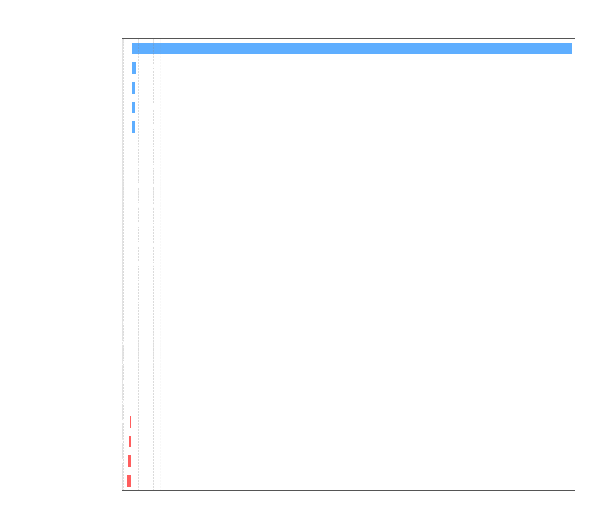
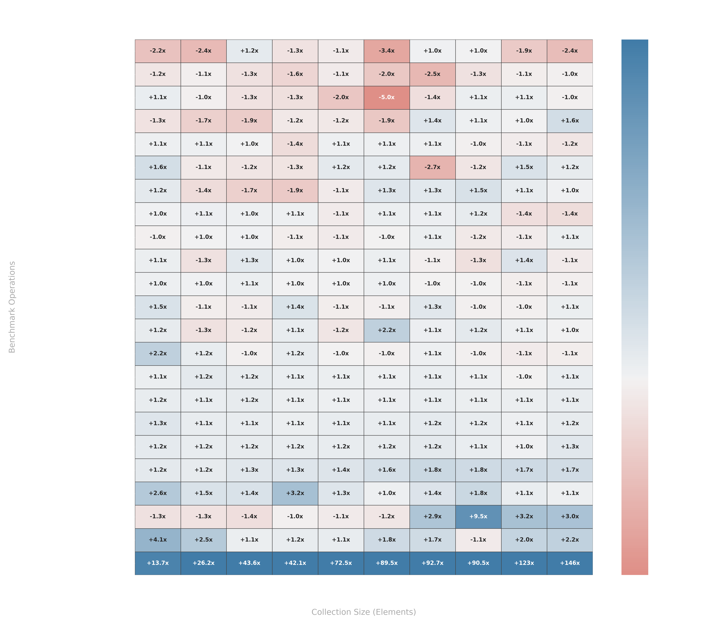
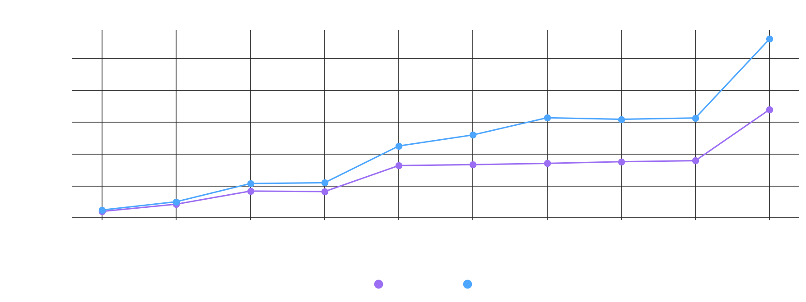
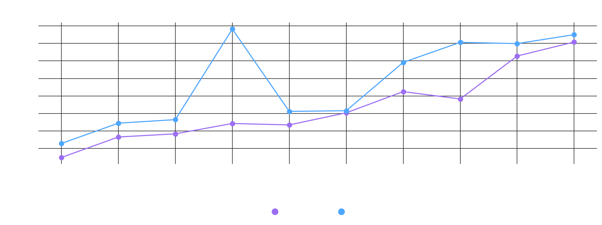
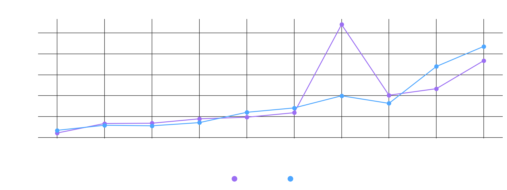
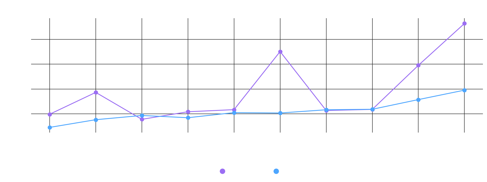
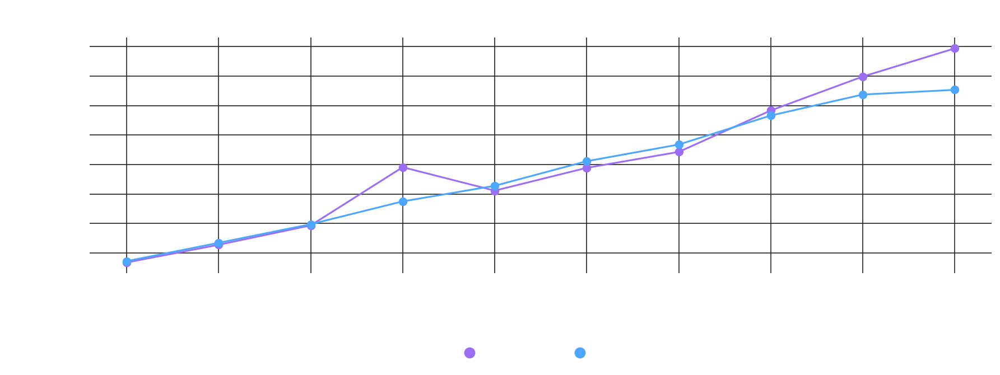
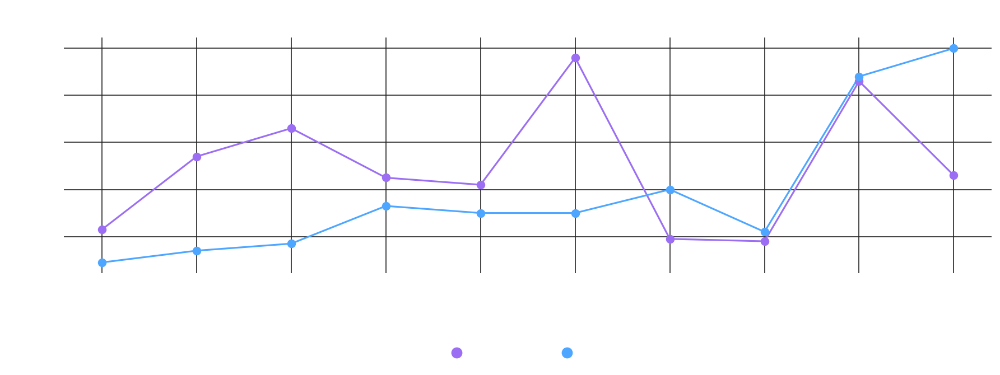
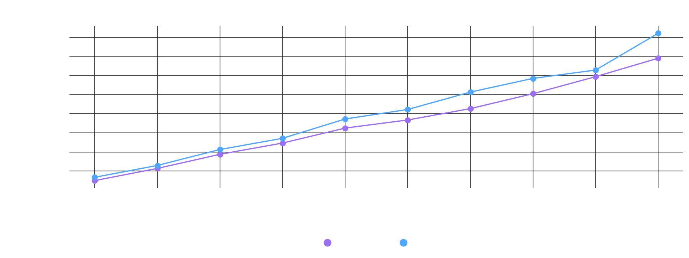
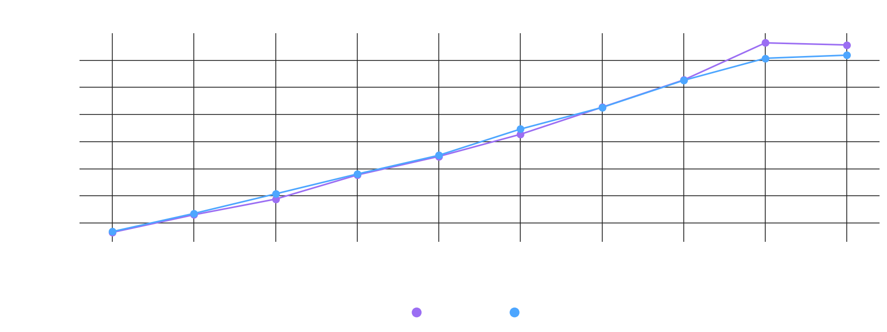
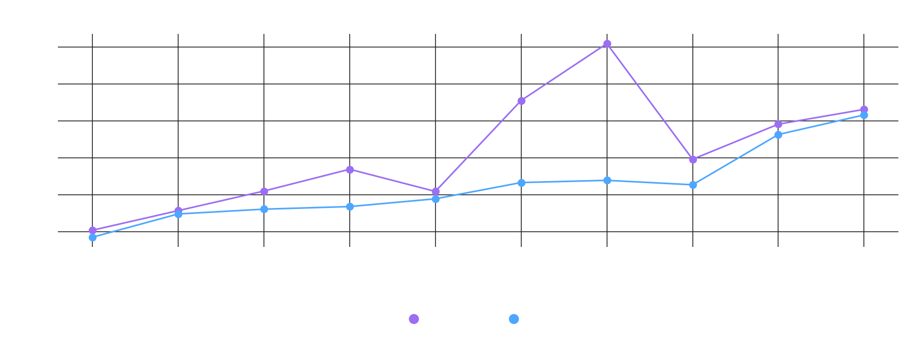
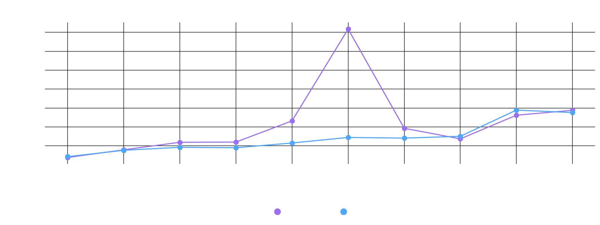
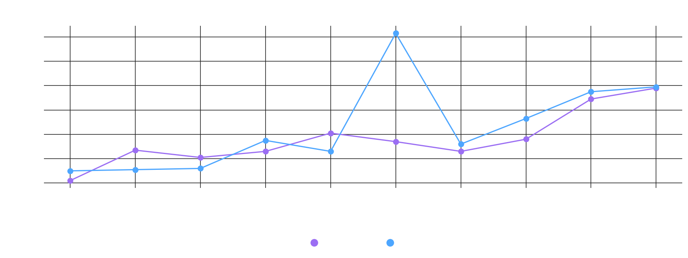
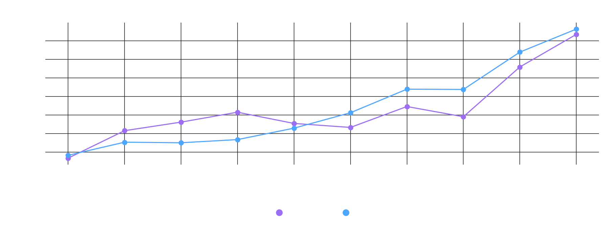
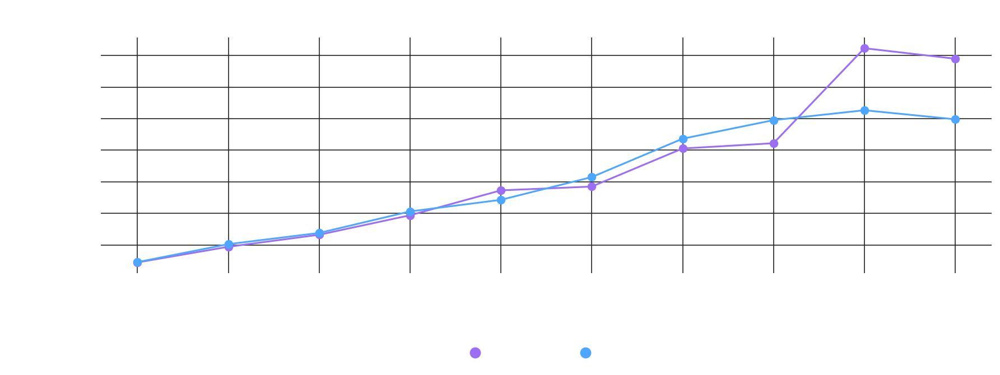
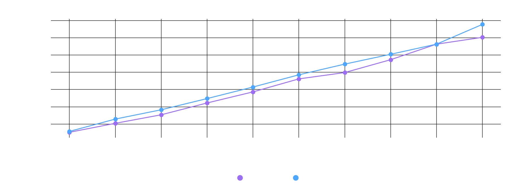
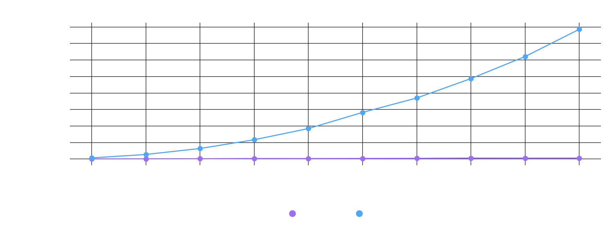
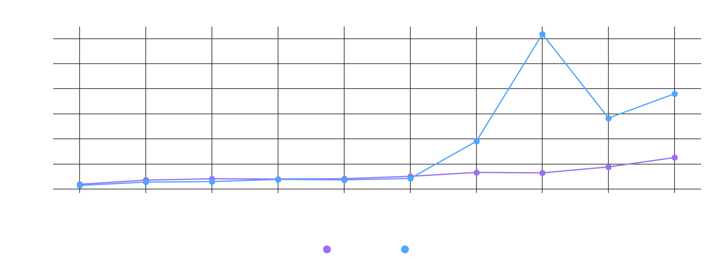
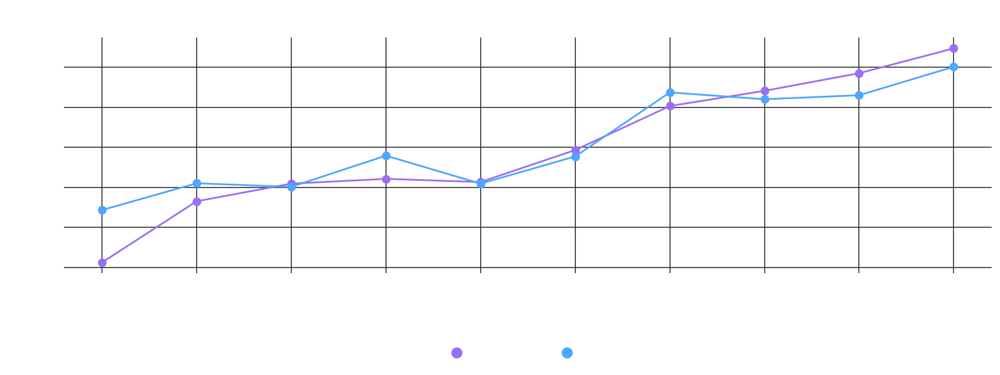
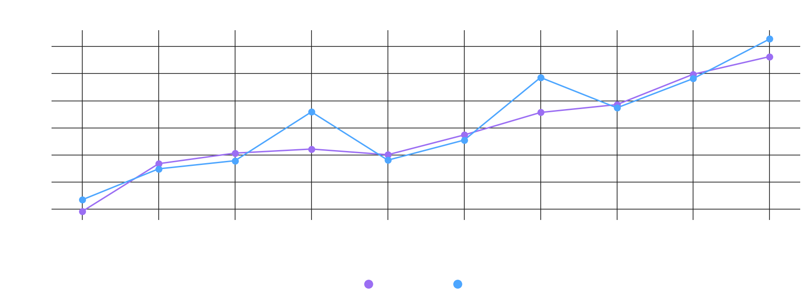
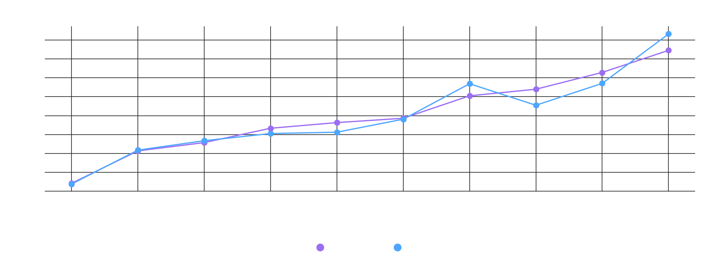
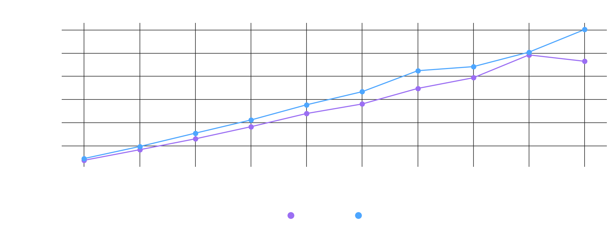
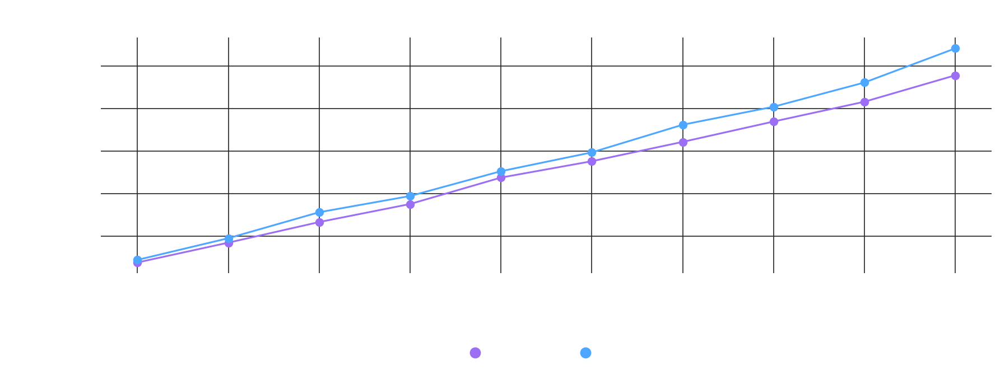
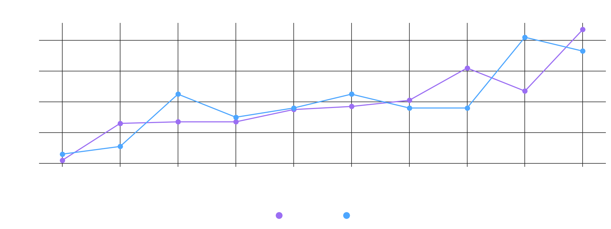
