# Custom Linked HashMap

Implementation of a LinkedHashMap.

All methods implemented are identical to those found in the Java Map interface.

# Build and Test

To build and test the project run command `./gradlew clean build`

To test the project run command `./gradlew test`

# Time Complexity

| Method                       |  CustomLinkedHashMap  |  LinkedHashMap (JDK)  | Winner |
|------------------------------|:---------------------:|:---------------------:|:------:|
| **clear()**                  |         O(n)          |         O(n)          |  Tie   |
| **containsKey(Object)**      |         O(1)          |         O(1)          |  Tie   |
| **containsValue(Object)**    |         O(n)          |         O(n)          |  Tie   |
| **entrySet()**               |         O(1)          |         O(1)          |  Tie   |
| **equals(Object)**           |         O(n)          |         O(n)          |  Tie   |
| **get(Object)**              |         O(1)          |         O(1)          |  Tie   |
| **getOrDefault(Object, V)**  |         O(1)          |         O(1)          |  Tie   |
| **hashCode()**               |         O(n)          |         O(n)          |  Tie   |
| **isEmpty()**                |         O(1)          |         O(1)          |  Tie   |
| **keySet()**                 |         O(1)          |         O(1)          |  Tie   |
| **put(K, V)**                |         O(1)          |         O(1)          |  Tie   |
| **putAll(Map)**              |         O(m)          |         O(m)          |  Tie   |
| **putIfAbsent(K, V)**        |         O(1)          |         O(1)          |  Tie   |
| **remove(Object)**           |         O(1)          |         O(1)          |  Tie   |
| **remove(Object, Object)**   |         O(1)          |         O(1)          |  Tie   |
| **removeEldestEntry(Entry)** |         O(1)          |         O(1)          |  Tie   |
| **replace(K, V)**            |         O(1)          |         O(1)          |  Tie   |
| **replace(K, V, V)**         |         O(1)          |         O(1)          |  Tie   |
| **size()**                   |         O(1)          |         O(1)          |  Tie   |
| **toString()**               |         O(n)          |         O(n)          |  Tie   |
| **values()**                 |         O(1)          |         O(1)          |  Tie   |

# Space Complexity

| Method                       | CustomLinkedHashMap | LinkedHashMap (JDK) | Winner |
|------------------------------|:-------------------:|:-------------------:|:------:|
| **clear()**                  |   O(1) auxiliary    |   O(1) auxiliary    |  Tie   |
| **containsKey(Object)**      |   O(1) auxiliary    |   O(1) auxiliary    |  Tie   |
| **containsValue(Object)**    |   O(1) auxiliary    |   O(1) auxiliary    |  Tie   |
| **entrySet()**               |   O(1) auxiliary    |   O(1) auxiliary    |  Tie   |
| **equals(Object)**           |   O(1) auxiliary    |   O(1) auxiliary    |  Tie   |
| **get(Object)**              |   O(1) auxiliary    |   O(1) auxiliary    |  Tie   |
| **getOrDefault(Object, V)**  |   O(1) auxiliary    |   O(1) auxiliary    |  Tie   |
| **hashCode()**               |   O(1) auxiliary    |   O(1) auxiliary    |  Tie   |
| **isEmpty()**                |   O(1) auxiliary    |   O(1) auxiliary    |  Tie   |
| **keySet()**                 |   O(1) auxiliary    |   O(1) auxiliary    |  Tie   |
| **put(K, V)**                |   O(1) auxiliary    |   O(1) auxiliary    |  Tie   |
| **putAll(Map)**              |   O(m) auxiliary    |   O(m) auxiliary    |  Tie   |
| **putIfAbsent(K, V)**        |   O(1) auxiliary    |   O(1) auxiliary    |  Tie   |
| **remove(Object)**           |   O(1) auxiliary    |   O(1) auxiliary    |  Tie   |
| **remove(Object, Object)**   |   O(1) auxiliary    |   O(1) auxiliary    |  Tie   |
| **removeEldestEntry(Entry)** |   O(1) auxiliary    |   O(1) auxiliary    |  Tie   |
| **replace(K, V)**            |   O(1) auxiliary    |   O(1) auxiliary    |  Tie   |
| **replace(K, V, V)**         |   O(1) auxiliary    |   O(1) auxiliary    |  Tie   |
| **size()**                   |   O(1) auxiliary    |   O(1) auxiliary    |  Tie   |
| **toString()**               |   O(1) auxiliary    |   O(1) auxiliary    |  Tie   |
| **values()**                 |   O(1) auxiliary    |   O(1) auxiliary    |  Tie   |

**Notes**:
- **n**: Total number of key-value mappings currently in the map.
- **m**: Number of key-value mappings in the input map.

# Performance

Below performance is a comparison made at 100,000 operations per method.

Note: all data is an average of 100 runs.

| Method                         | CustomLinkedHashMap (ns) | LinkedHashMap (JDK) (ns) |      Winner      | Margin  |
|:-------------------------------|:-------------------------|:-------------------------|:----------------:|:-------:|
| put(K,V)                       | 279.0                    | 400.0                    |     *Custom*     |  x1.43  |
| get(K)                         | 51.0                     | 53.0                     |     *Custom*     |  x1.04  |
| getOrDefault(K,V)              | 102.0                    | 84.0                     | *LinkedHashMap*  |  x1.21  |
| remove(K)                      | 3,425.0                  | 3,016.0                  | *LinkedHashMap*  |  x1.14  |
| remove(K,V)                    | 1,358.0                  | 2,120.0                  |     *Custom*     |  x1.56  |
| containsKey(K)                 | 65.0                     | 150.0                    |     *Custom*     |  x2.31  |
| containsValue(V)               | 170,937.0                | 166,859.0                | *LinkedHashMap*  |  x1.02  |
| putIfAbsent(K,V)               | 3,695.0                  | 537.0                    | *LinkedHashMap*  |  x6.88  |
| replace(K,V)                   | 112.0                    | 111.0                    |      *Tie*       |  x1.00  |
| replace(K,V,V)                 | 129.0                    | 128.0                    |      *Tie*       |  x1.00  |
| keySet()                       | 67.0                     | 49.0                     | *LinkedHashMap*  |  x1.37  |
| values()                       | 50.0                     | 57.0                     |     *Custom*     |  x1.14  |
| clear()                        | 72,204.0                 | 66,308.0                 | *LinkedHashMa*p  |  x1.09  |
| equals(Object o)               | 441,883.0                | 607,620.0                |     *Custom*     |  x1.38  |
| toString()                     | 2,054,441.0              | 2,922,745.0              |     *Custom*     |  x1.42  |
| entrySet()                     | 58.0                     | 44.0                     | *LinkedHashMap*  |  x1.32  |
| putAll(Map)                    | 1,922,596.0              | 2,324,066.0              |     *Custom*     |  x1.21  |
| compute(K,BiFunction)          | 375.0                    | 266.0                    | *LinkedHashMap*  |  x1.41  |
| computeIfAbsent(K,Function)    | 741.0                    | 1,128.0                  |     *Custom*     |  x1.52  |
| computeIfPresent(K,BiFunction) | 116.0                    | 211.0                    |     *Custom*     |  x1.82  |
| forEach(BiConsumer)            | 268,337.0                | 235,058.0                | *LinkedHashMap*  |  x1.14  |
| merge(K,V,BiFunction)          | 149.0                    | 167.0                    |     *Custom*     |  x1.12  |
| replaceAll(BiFunction)         | 805,712.0                | 1,849,566.0              |     *Custom*     |  x2.30  |

# Performance Charts

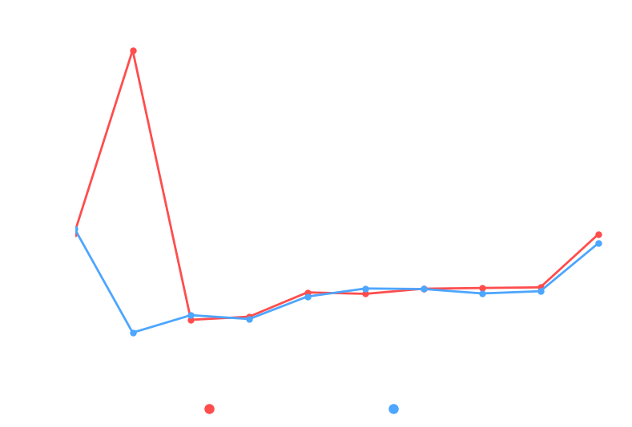
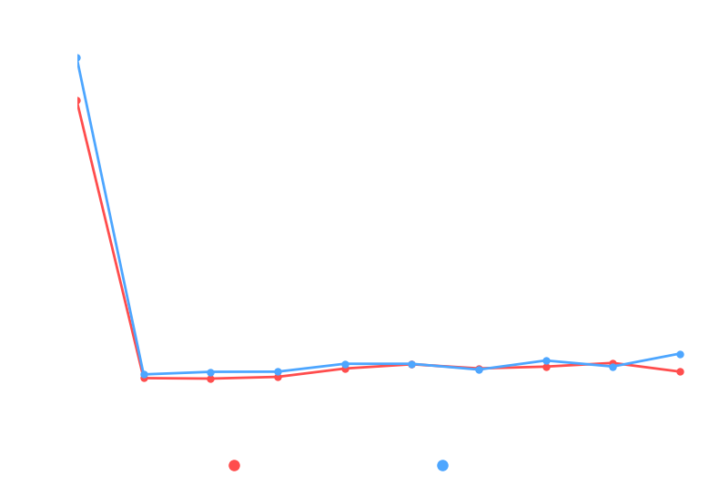
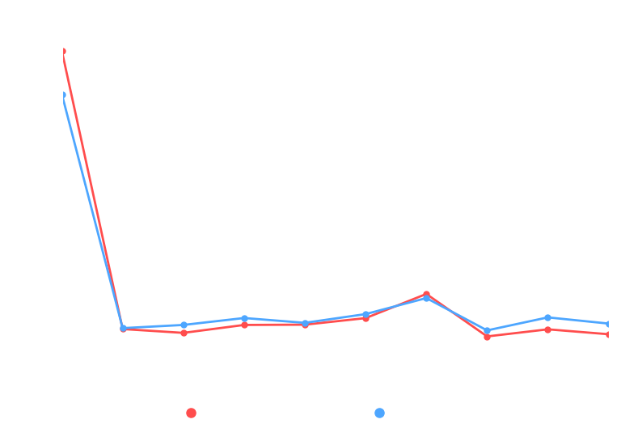
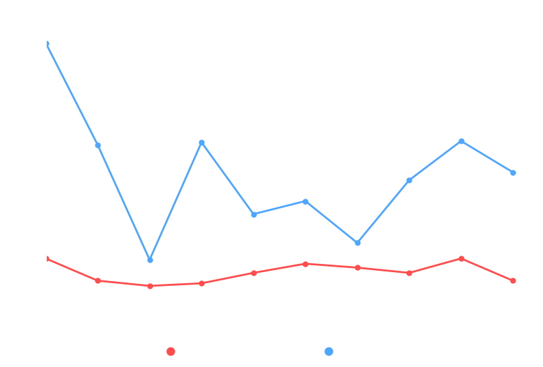
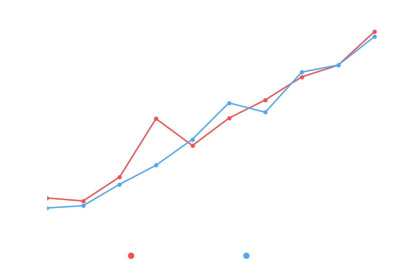
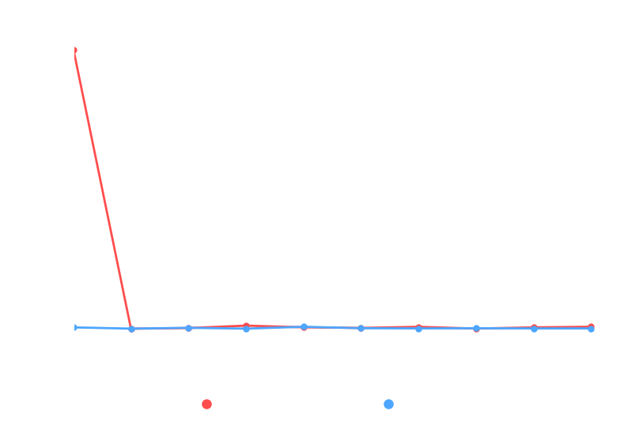
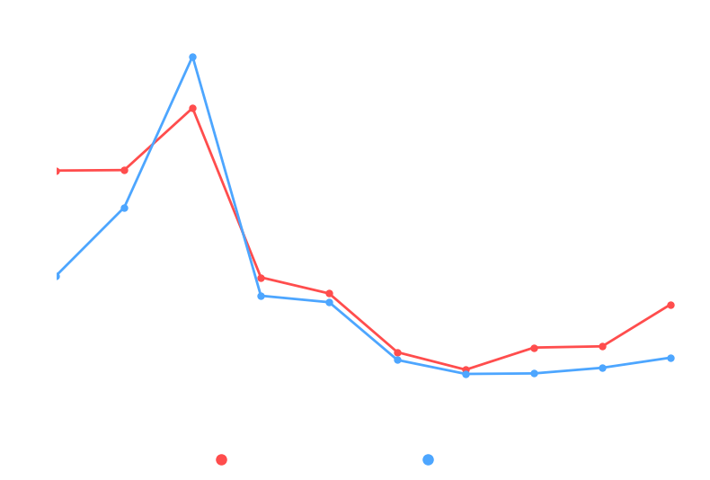
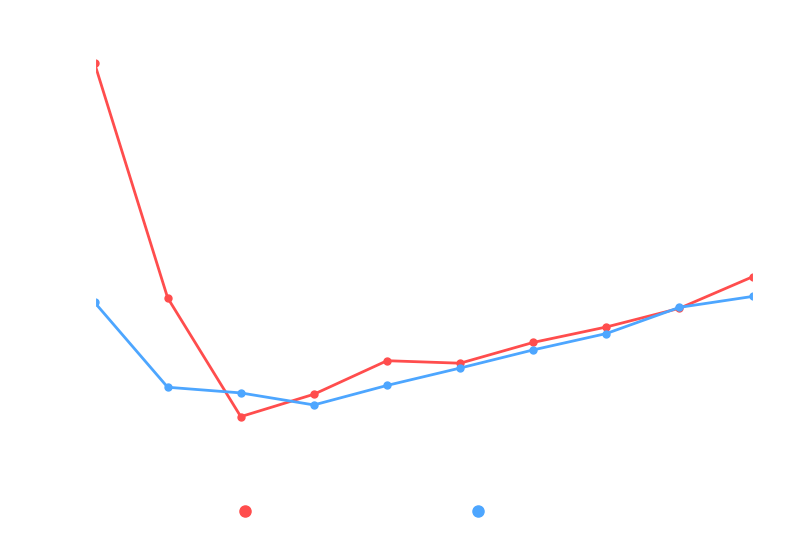
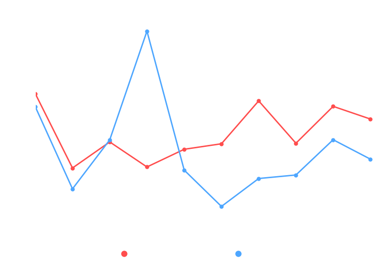
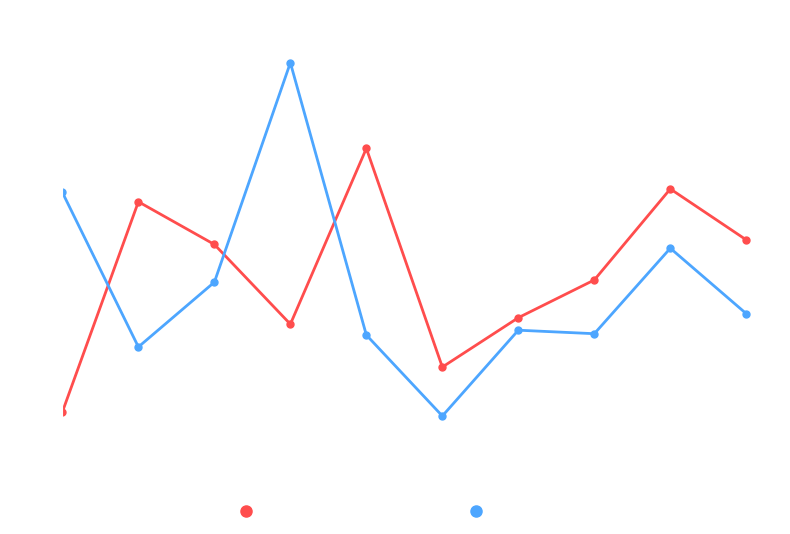
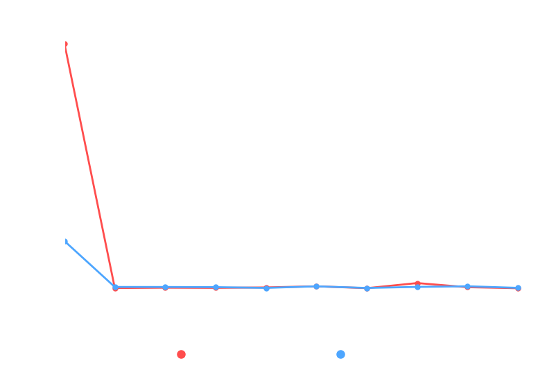
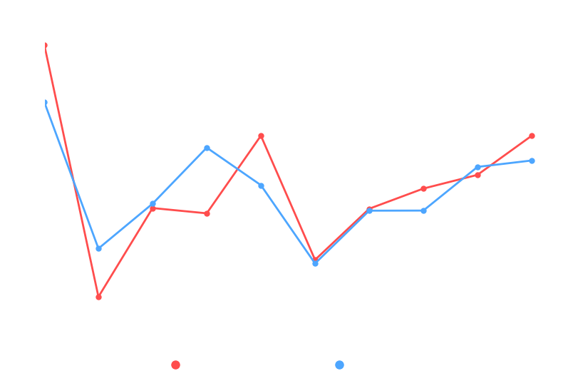
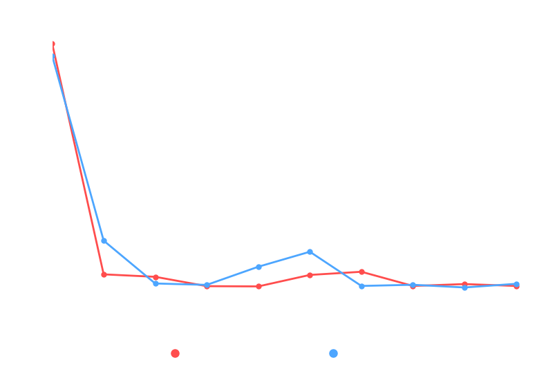
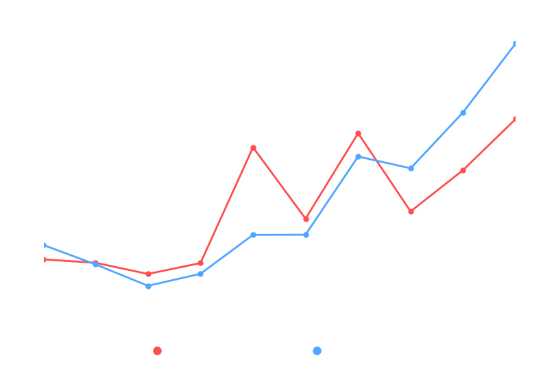
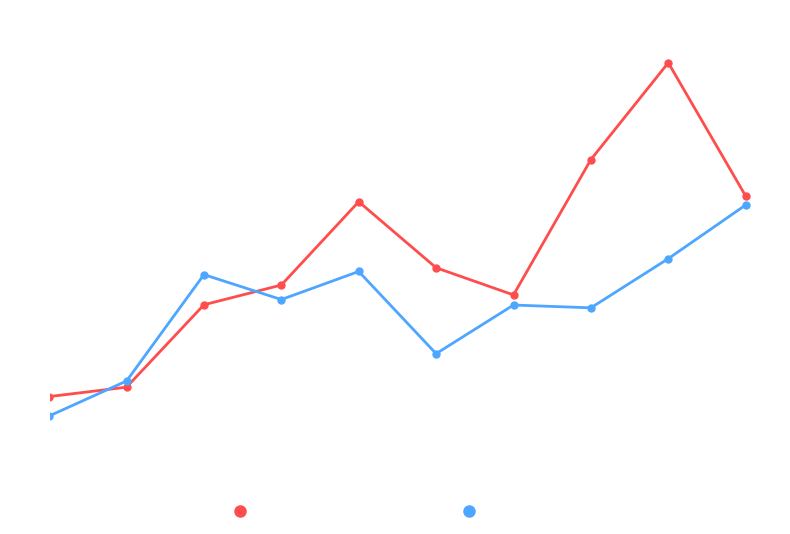
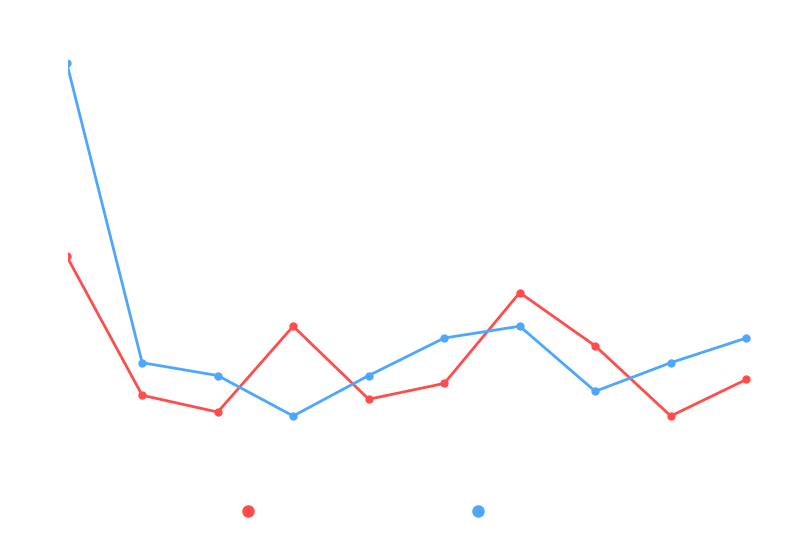
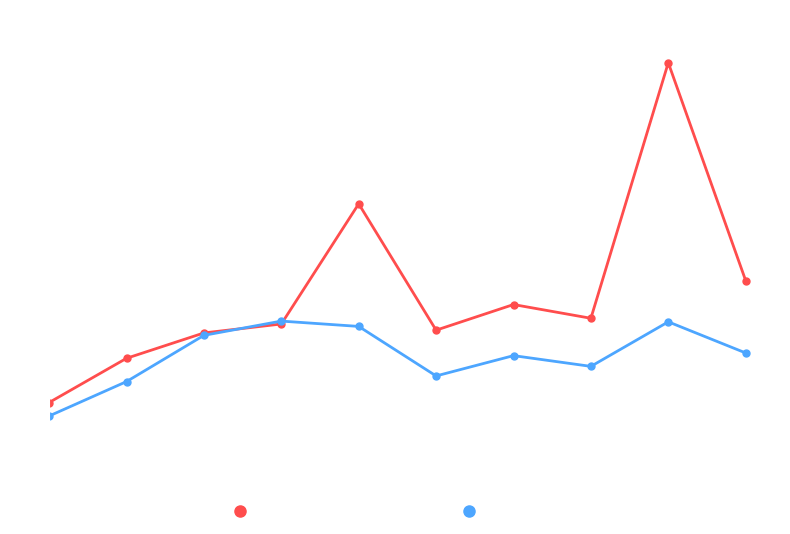
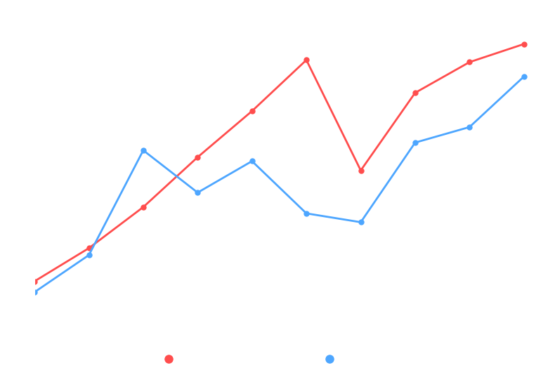
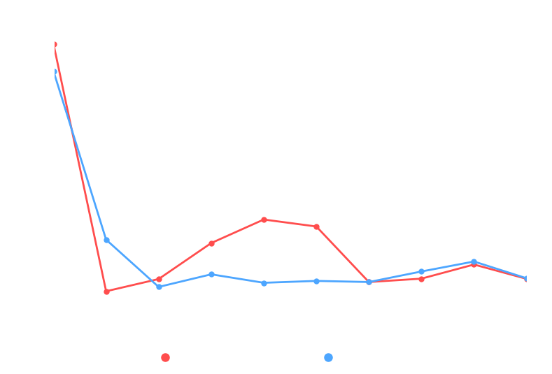
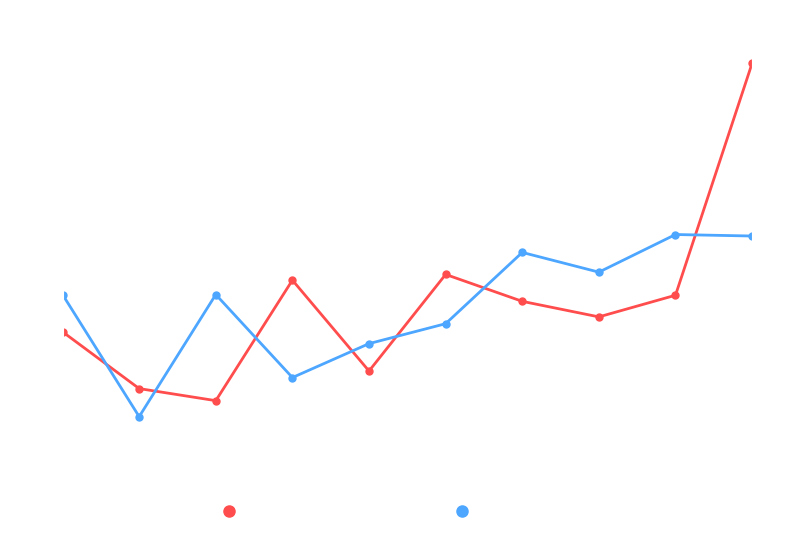
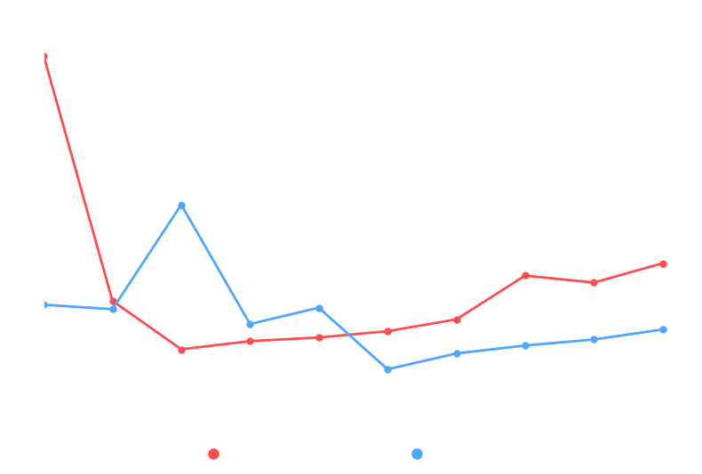
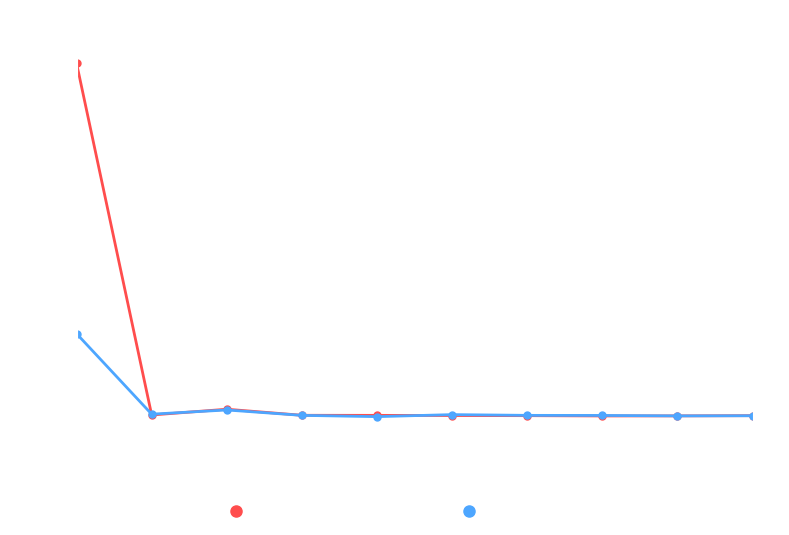

